# LoggerHandlerKit

📚 Logger Handler Kit is an _educational_ Hex package! The goal is to help people
understand how to write and test logger handlers. This is a great package if you
want to:

* learn more about logging
* write your own logger handler
* bootstrap tests
* improve your test coverage
* learn how to make your tests async

You can use this package in a number of ways:

* Read through the docs to learn about concepts
* Read through the code to learn how to make things work
* Add as a test dependency for your app and actually use test helpers

## AAA

Since the package's primary goal is to aid with tests, its most important parts
are organized into three modules that embody what is called an AAA test pattern. The
AAA stands for three main stages of a test: Arrange, Act and Assert:

* `LoggerHandlerKit.Arrange` helps with setting up handlers for tests
* `LoggerHandlerKit.Act` suggests a menu of interesting test cases
* `LoggerHandlerKit.Assert` provides a single assert function with a very important job

## Example Test Suite

Logger Handler Kit comes with a fully asynchronous test suite for the default
Elixir logger handler, inspired by tests in `Sentry`, `DiscoLog` and Elixir
itself. It demonstrates how a handler can be tested with a fully async suite by
employing pretty much every trick in LoggerHandlerKit's repertoire:

1. It creates a dedicated handler for each test. 
2. It guards the test handler against irrelevant log events with an ownership filter. 
3. It configures the `logger_std_h` handler to write to a fake IO device instead of
stdout. The device relays all received writes back to the test process. 
4. It uses `LoggerHandlerKit.Arrange.ensure_per_handler_translation/1` to enable
switching `handle_otp_reports` and `handle_sasl_reports` without impacting the rest
of the application.

Here's a visualization of how test setup compares to the regular application
setup. Note how test process logs use a separate "path" thanks to a dedicated
logger handler guarded by the ownership filter:

```mermaid
---
config:
    look: handDrawn
    theme: neutral
---
flowchart TD
    subgraph before[Normal Setup]
        test_pid[Test Process] --> test_log
        other_tests[Other Tests] --> other_log 
        test_log@{shape: rounded, label: [log event]} --> translator
        other_log@{shape: rounded, label: [log event]} --> translator
        
        subgraph primary[Primary Filters]
            translator[:logger_translator]
        end
        
        subgraph handlers
            default_handler
        end
        
        translator --> default_handler[:default handler]
        default_handler --> stdout[standard output]
    end
    subgraph after[Async Setup]
        test_pid2[Test Process] --> test_log2
        other_tests2[Other Tests] --> other_log2 
        test_log2@{shape: rounded, label: [log event]} --> no_filters
        other_log2@{shape: rounded, label: [log event]} --> no_filters
        subgraph primary2[Primary Filters]
            no_filters@{shape: braces, label: [No Filters]}
        end
        no_filters --> default_translator
        no_filters --> ownership_filter
        subgraph handlers2[Handlers]
            default_translator[:logger_translator] --> default_handler2[:default handler]
            ownership_filter[ownership filter] --> test_translator[:logger_translator]
            test_translator[:logger_translator] --> test_handler[test handler]
        end
        default_handler2 --> stdout2[standard output]
        test_handler[test handler] --> fakeio[FakeIODevice]
    end
```




## Getting ~~Started~~ Good

1. Add the package to your project as a test dependency

```elixir
def deps do
  [
    # The package only makes sense for tests!
    {:logger_handler_kit, only: :test, "~> 0.4.0"}
  ]
end
```

2. Replace `MyHandler` with your handler name and make this test green:

```elixir
defmodule MyHandlerTest do
  use ExUnit.Case, async: true

  setup_all {LoggerHandlerKit.Arrange, :ensure_per_handler_translation}

  setup %{test: test} = context do
    {context, on_exit} =
      LoggerHandlerKit.Arrange.add_handler(
        test,
        MyHandler,
        %{}
      )

    on_exit(on_exit)
    context
  end

  test "string message", %{handler_ref: ref} do
    LoggerHandlerKit.Act.string_message()
    LoggerHandlerKit.Assert.assert_logged(ref)
  end
end
```

3. Add assertions that make sense for your handler to the test and make it green again.
4. Write a passing test for each function in the `LoggerHandlerKit.Act` module.

🎉 Congratulations, your logger handler is now pretty good and you have a decent asynchronous test suite on your hands.

## TODO

* [x] cover metadata
* [ ] cover overload protection
* [x] cover encoding/serialization
* [ ] cover logging packages overview